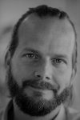

Welcome at the staff website of the Clinical Data Science group at Maastricht University, Maastricht UMC+ and Maastro Clinic.

# Current staff
*  [Inigo Bermejo](people/InigoBermejo.html)
*  [Andre Dekker](people/AndreDekker.html)
*  [Rianne Fijten](people/RianneFijten.html)
*  [Audrey Janssen](people/AudreyJanssen.html)
*  [Aiara Lobo Gomes](people/AiaraLoboGomes.html)
*  [Johan van Soest](people/JohanVanSoest.html)
*  [Alberto Traverso](people/AlbertoTraverso.html)
*  [Leonard Wee](people/LeonardWee.html)
* etc. etc.

# Alumni
* Anshu Ankolekar
* Biche Osong
* etc. etc.
